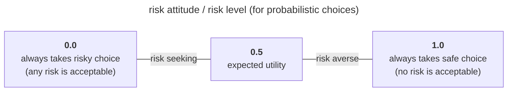

# Simulating Risk

The code in this repository is associated with the CDH project [Simulating risk, risking simulations](https://cdh.princeton.edu/projects/simulating-risk/).

Simulations are implemented with [Mesa](https://mesa.readthedocs.io/en/stable/), using Agent Based Modeling to explore risk attitudes within populations.

Across simulations, we define agents with risk attitudes tracked via a numeric `r` or `risk_level` 0.0 - 1.0, where `r` is that agent's minimum acceptable risk level. An agent with `r=1` will always take the safe option (no risk is acceptable); an agent with `r=0` will always take the risky choice (any risk is acceptable).





## Development instructions

Initial setup and installation:

- *Recommmended*: create and activate a Python 3.9 virtualenv:
```sh
python3 -m venv simrisk
source simrisk/bin/activate
```
- Install the package, dependencies, and development dependencies:
```sh
pip install -e .
pip install -e ".[dev]"
```

### Running the simulations

- Simulations can be run interactively with mesa runserver by specifying
  the path to the model, e.g. `mesa runserver simulatingrisk/risky_bet/`
  Refer to the readme for each model for more details.
- Simulations can be run in batches to aggregate data across multiple
  runs and different parameters. For example,
  `./simulatingrisk/batch_run.py riskyfood`


### Install pre-commit hooks

Install pre-commit hooks (currently [black](https://github.com/psf/black) and [ruff](https://beta.ruff.rs/docs/)):

```sh
pre-commit install
```
