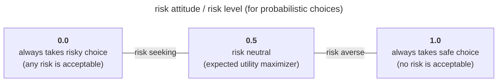

# Simulating Risk

[](https://doi.org/10.5281/zenodo.18361156)
[](https://github.com/DHCodeReview/simulating-risk/pull/1) [](https://github.com/Princeton-CDH/simulating-risk/actions/workflows/unit_tests.yml)

The code in this repository is associated with the CDH project [Simulating risk, risking simulations](https://cdh.princeton.edu/projects/simulating-risk/).

Simulations are implemented in Python with [Mesa](https://mesa.readthedocs.io/en/stable/), using Agent Based Modeling to explore risk attitudes within populations.

---

## Simulations with risk attitudes and agent interaction

- [Hawk/Dove with risk attitudes](simulatingrisk/hawkdove)
- [Hawk/Dove with multiple risk attitudes and adjustment](simulatingrisk/hawkdovemulti)

> [!TIP]  
> Run an [interactive version of the simulation online](https://princeton-cdh.github.io/simulating-risk/app/)

The code for **Hawk/Dove with risk attitudes** and **Hawk/Dove with multiple risk attitudes** in this codebase was [reviewed](https://github.com/DHCodeReview/simulating-risk/pull/1) in June 2024 by [Scott Foster](https://github.com/sgfost) and [Malte Vogl](https://github.com/maltevogl) (Senior Research Fellow, Max Planck Institute of Geoanthropology) via [DHTech Community Code Review](https://dhcodereview.github.io/); review was facilitated by [Cole Crawford](https://github.com/ColeDCrawford) (Senior Software Engineer, Harvard Arts and Humanities Research Computing).

## Simulations with risky choices (environment)

- [Risky Food](simulatingrisk/risky_food)
- [Risky Bet](simulatingrisk/risky_bet)

## Risk attitude definitions

Across simulations, we define agents with risk attitudes tracked via a numeric `r` or `risk_level` 0.0 - 1.0, where `r` is that agent's minimum acceptable risk level for taking the risky bet. When the probability 'p' of the risky bet paying off is greater than an agent's 'r', that agent will take the bet. An agent with `r=1` will always take the safe option (no risk is acceptable); an agent with `r=0` will always take the risky choice (any risk is acceptable). Notice that the agent is never indifferent; allowing indifference would require introducing a tie-breaking rule, which would be a further parameter.

When the risky bet might be better or worse than the safe bet by the same amount (for example, the risky bet yields 3 or 1 and the safe bet yields 2), an agent who maximizes expected utility will prefer the risky bet when p > 0.5 and will prefer the safe bet when 'p < 0.5'; and they will be indifferent between the risky bet and the safe bet. Thus, r = 0.5 corresponds to expected utility maximization except in the case in which the probability is exactly 0.5 (or, we might say, a point epsilon units to the left of 0.5, where epsilon is smaller than the fineness of our random number generator, corresponds to expected utility maximization). These complications make no difference in practice, so we can simply say that r = 0.5 corresponds to expected utility maximization.


```mermaid
---
title: risk attitude / risk level (for probabilistic choices)
---
flowchart LR
    r0["<b>0.0</b>
always takes risky choice
(any risk is acceptable)"]
    reu["<b>0.5</b>
risk neutral
(expected utility maximizer)"]
    r1["<b>1.0</b>
always takes safe choice
(no risk is acceptable)"]
    r0 ---|risk seeking|reu---|risk averse|r1
```

## Development instructions

Initial setup and installation:

- _Recommmended_: use [`uv`](https://docs.astral.sh/uv/) to create a Python 3.12 virtualenv and install dependencies, including development dependencies:

```sh
uv sync
```

### Install pre-commit hooks

Install pre-commit hooks (currently [black](https://github.com/psf/black) and [ruff](https://beta.ruff.rs/docs/)):

```sh
pre-commit install
```

### Interactive interface to the simulations

We use a marimo notebook as the interface for running the Hawk/Dove simulation interactively. To run locally for development, using
the local development environment, run with sandbox disabled:

```sh
uv run marimo edit simulatingrisk/app.py --no-sandbox
```

For publication via static site, this notebook should be saved as html + web assembly. This requires a version of the `simulatingrisk` package that can be installed in pyodide, either by a published version on pypi or a local wheel for testing.

To export as html+wasm in edit mode, to debug any wasm-specific problems:

```sh
uv run marimo export html-wasm simulatingrisk/app.py -o docs/app/ --mode edit
```

For convenience, a `.justfile` is included for building documentation and serving locally. Requires [just](https://github.com/casey/just) version 1.52 or newer.

With `just` installed, run the following to build the documentation and serve it locally:

````sh
just docs
just serve-docs
```

That is equivalent to running the following commands. To export manually in run mode:

```sh
uv run marimo export html-wasm simulatingrisk/app.py -o docs/app/ --mode run --no-sandbox -f
````

To view locally, start a python webserver:

```sh
python -m http.server --directory docs/
```

The interactive simulation will be available at http://localhost:8000/simulating-risk/app/

For testing the html+wasm application notebook with a local version of the simrisk code (notebook must be updated to install simulatingrisk from the wheel; make sure the version string and filename match exactly).

```sh
uv build --wheel -o docs/app/public/
uv run marimo export html-wasm simulatingrisk/app.py --mode edit -o docs/app/ --no-sandbox -f
just serve-docs
```

Make sure any changes made to the editable html+wasm version of the app get propagated back to the python version.

To export static html copies of analysis notebooks:

```sh
uv run marimo export html notebooks/evolv-risk-attitudes/convergence.py -o docs/analysis/evolve/index.html
```

## Publishing to PyPI

This package has been [published on PyPI](https://pypi.org/project/simulatingrisk/) to simplify running the interactive simulation. This is not automated with a GitHub Actions workflow; use `uv` to publish (requires access on pypi and credentials):

```sh
uv build --wheel
uv publish
```
